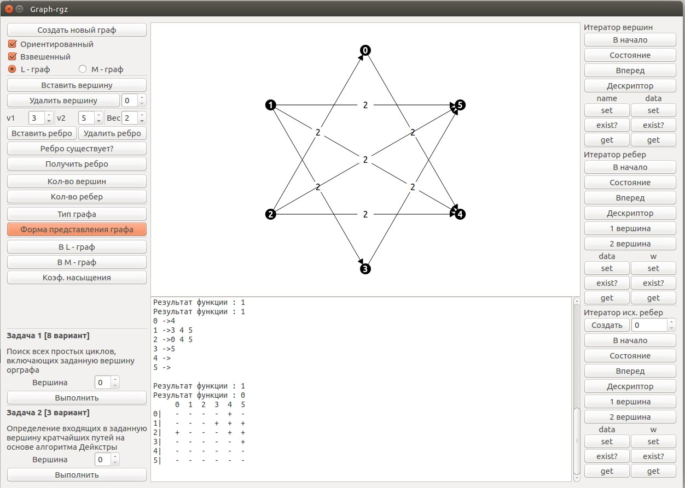

# alg-rgr
Расчетно-графическое задание по дисциплине "Алгоритмы и структуры данных"

Программа для работы с графом (на qt).
Реализован контейнер графа + итераторы ребер, вершин, исходящих ребер и парочка алгоритов обхода в глубину и ширину.

### Скриншот

